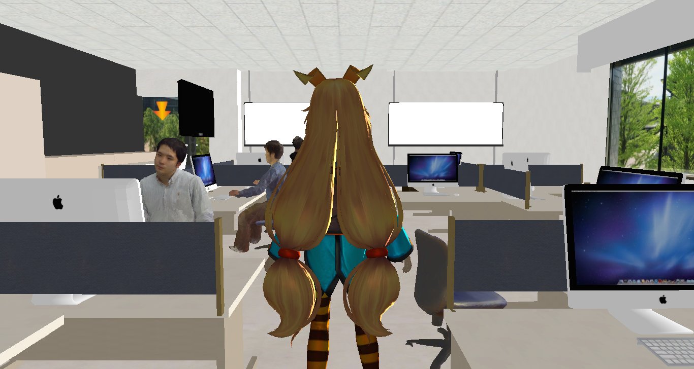
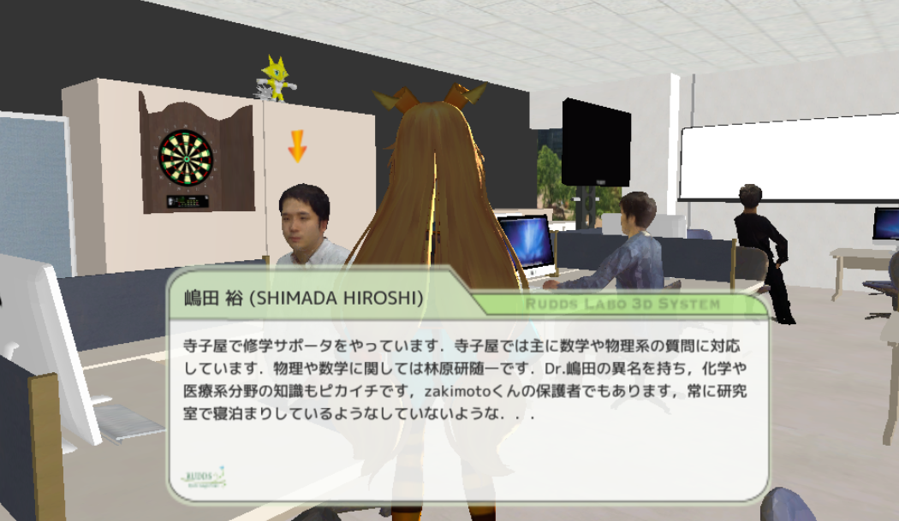
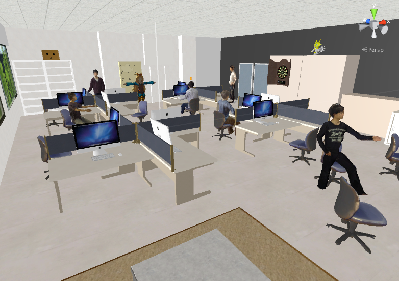

# Labo3D
Labo3D is a virtual 3d labo visiting system.

You can see some members of labo in 3D space, and know a information about a person whatever you want to know.

We use Unity as developing environment.

##Author
Tasuku TAKAHASHI(supertask)
Kengo Imae

##Released
Aug 2015

##LICENSE
MIT