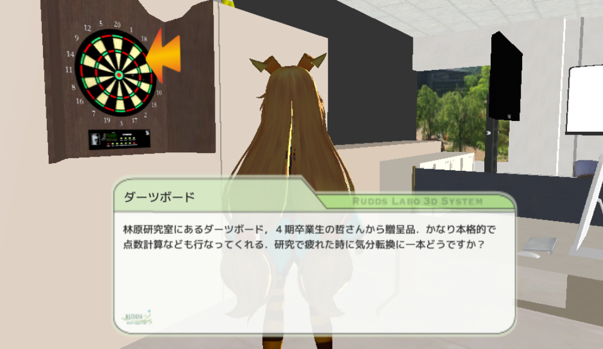

# Labo3D
Look at [Labo3D](http://rudds.jp/labo3d) ([http://rudds.jp/labo3d](http://rudds.jp/labo3d)). Labo3D is a virtual 3d labo visiting system.
We reproduce Hayashibra labo that we belong.

You can see some members of labo in 3D space, and know a information about a person whatever you want to know.

And you can see some object in labo, too.

We use Unity as developing environment.

##Author
Tasuku TAKAHASHI (supertask)  
Kengo Imae (kengo92i)

##Released
Aug 2015

##LICENSE
MIT
